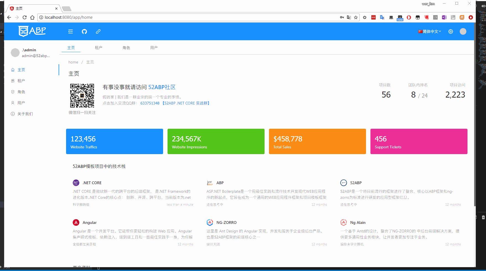
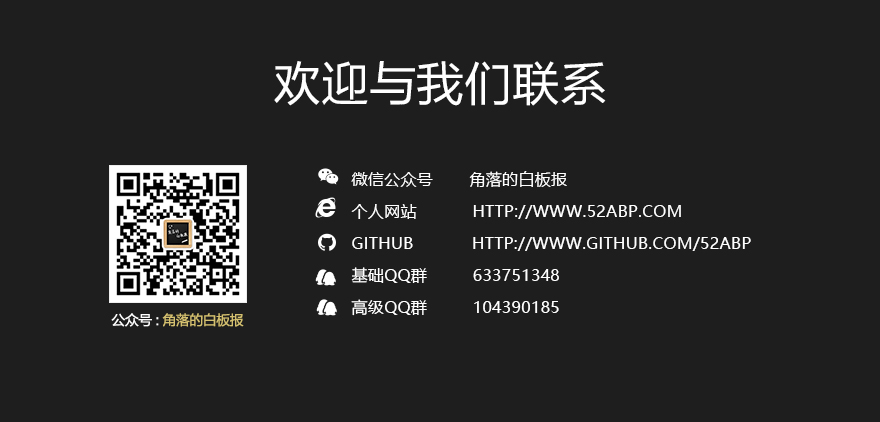

# Introduction

This template is based on the template project provided by ASP.NET Core and Angular to 52ABP for download.

-Quick start tutorial: [Create ASP.NET Core and Angular free project template building tutorial (single page template)](https://www.52abp.com/BlogDetails/1)


## download link

Create your own independent project information through 52ABP: https://www.52abp.com/Download/Index


## Startup project

We recommend that you create your own project template from [https://www.52abp.com](https://www.52abp.com/Download/Index), this project template is a unified startup template, you can be like us Contribute your code information.

More detailed startup tutorials:
[52ABP-Developer Center](https://www.52abp.com/Wiki/52abp/master/docs/Introduction)

### Remarks:
```
Default username: admin

Default password: bb123456
```

## About 52ABP

52ABP is a powerful framework that integrates the front and back ends,
The back end is a secondary encapsulation and integration of .NET Core and ABP framework
The front end integrates Ng-Zorro, Ng-alain and other components on the basis of Angular
The architecture level is also a classic layered architecture based on DDD (Domain Driven Design). The purpose is to become a modern WEB application framework with a powerful infrastructure that conforms to the development habits of Chinese people.


## Tutorial
 
-NetEase course address: [ASP.NET Core and Angular6 rapid development](https://study.163.com/provider/400000000309007/index.htm?share=2&shareId=400000000309007)
 
-Document: [52ABP Developer Center](https://www.52abp.com/Wiki/52abp/latest/Getting-Started)


[52ABP template ASP.Net Core and Angular open source example project
](https://www.cnblogs.com/wer-ltm/p/9358478.html)

## Frontend Template-Stream-Bootstrap 4 Dashboard UI Kit

* Open source address: [github](https://github.com/htmlstreamofficial/stream-dashboard-ui-kit)
* Preview address: [htmlstream](https://htmlstream.com/preview/stream-dashboard-ui-kit/index.html)

## Screenshot


 

 
 


#### Code related mirror warehouse:

Code Cloud: [Domestic Mirror](https://gitee.com/yoyocms/LTMCompanyNameFree.YoyoCmsTemplate)

Github: [Main Repository](https://github.com/52ABP/LTMCompanyNameFree.YoyoCmsTemplate)
# contact us


**Welcome to pay attention to the white board in the corner**
 

 


# Description of front-end project

**How ​​to read the documentation**

Before starting, there are some documents describing conventions, which will help to read better:

-API related
  -`[]` means attribute
  -`()` means event
  -`[()]` means two-way binding
  -`ng-content` represents a placeholder for component content
  -The beginning of `#tpl` means `<ng-template #tpl>`
-Object-related, generally in class description
  -`[]` means attribute
  -How to indicate the end of `()`
## Commonly used front-end commands

Generate the components of the specified path
`
  ng generate component persons/create-or-edit-person-modal
`
# About contribution

The above is a brief description of the project. I will continue to communicate with you when I have time in the future. Everyone is also welcome to improve the content.
[More content...](https://github.com/52ABP/Documents/blob/master/52ABP%E5%BC%80%E5%8F%91%E4%BA%BA%E5%91%98 %E4%B8%AD%E5%BF%83/52ABP%E5%9B%A2%E9%98%9F%E6%AC%A2%E8%BF%8E%E6%82%A8%E7%9A%84 %E5%88%B0%E6%9D%A5.md)
